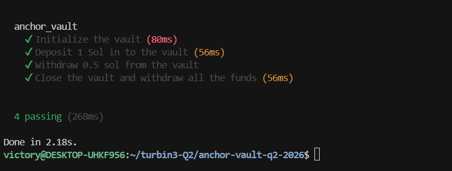
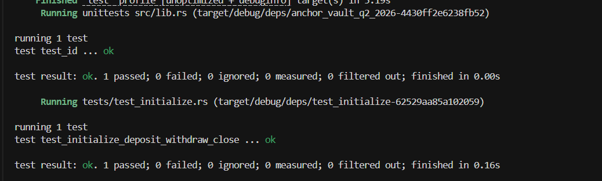

# Anchor Vault

A Solana program built with Anchor that lets a user create a personal SOL vault — initialize it, deposit funds, withdraw funds, and close it to reclaim rent.

## Program ID

`FZ6rfnsv1AojeU9kVLsrUNbSSRpWhcHDMKMXtq47p3We`

## Architecture

The program uses two PDAs per user:

- **`vaultState`** — seeds: `["state", user]` — stores the bumps for both PDAs.
- **`vault`** — seeds: `["vault", vaultState]` — the actual SOL-holding account.

```
user
 ├── vaultState PDA  (stores vault_bump + state_bump)
 └── vault PDA       (holds SOL)
```

## Instructions

| Instruction | Description |
|-------------|-------------|
| `initialize` | Creates the `vaultState` and `vault` PDAs for the user |
| `deposit(amount)` | Transfers `amount` lamports from user to vault |
| `withdraw(amount)` | Transfers `amount` lamports from vault back to user |
| `close` | Drains all SOL from vault to user and closes both accounts |

## Getting Started

### Prerequisites

- [Rust](https://www.rust-lang.org/tools/install)
- [Solana CLI](https://docs.solana.com/cli/install-solana-cli-tools)
- [Anchor](https://www.anchor-lang.com/docs/installation)
- Node.js + Yarn

### Build

```bash
anchor build
```

### Test

```bash
anchor test
```

This runs the TypeScript test suite against a local validator. All four tests should pass:

```
anchor_vault
  ✔ Initialize the vault
  ✔ Deposit 1 Sol in to the vault
  ✔ Withdraw 0.5 sol from the vault
  ✔ Close the vault and withdraw all the funds
```

### Deploy

```bash
anchor deploy
```

## Tests

### TypeScript Tests (Anchor)



### Rust Tests (LiteSVM)


